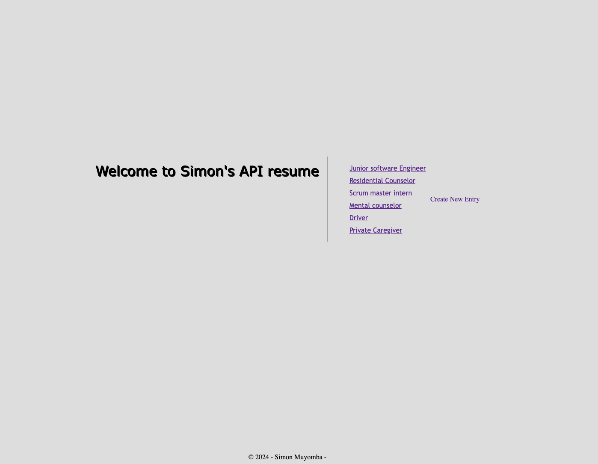

# Resume Web Application

This is a simple web application built using Express.js that allows users to create and display their resume information.

## Technologies Used

- Express.js
- dotenv
- colors
- morgan

## Installation

1. Install the required dependencies:

2. Create a `.env` file in the root directory and add the following environment variable:
 
3. Replace `3000` with the desired port number.
4. Start the server:
 
The server will start running on the specified port.

## Routes

1. **Index Route**: `/resume`
- Displays a list of all the resumes.

2. **New Route**: `/resume/new`
- Provides a form to create a new resume.

3. **Post Route**: `/resume`
- Handles the submission of the new resume form.

4. **Show Route**: `/resume/:id`
- Displays the details of a specific resume.

## Data Model

The resume data is stored in the `./models/data.js` file. Each resume is represented as an object with the following properties:

- `title`: The job title.
- `company`: The company name.
- `startDate`: The start date of the job.
- `endDate`: The end date of the job.
- `workSkills`: The skills related to the job.
- `location`: The job location.
- `fullTime`: A boolean indicating whether the job was full-time or not.

## Usage

1. Start the server and navigate to `http://localhost:3000/resume` in your web browser.
2. Click on the "New" button to create a new resume.
3. Fill in the resume details and submit the form.
4. The new resume will be added to the list on the index page.
5. Click on a resume in the list to view its details.
6. 
## Future Improvements

1. **User Authentication**: Implement user authentication to allow users to manage their own resumes.
2. **Resume Editing**: Add the ability to edit existing resumes.
3. **Resume Deletion**: Provide an option to delete resumes.
4. **Resume Sorting and Filtering**: Add sorting and filtering functionality to the resume list.
5. **Resume Downloading**: Allow users to download their resumes in various formats (e.g., PDF, Word).
## Contributing

If you find any issues or have suggestions for improvements, please feel free to create a new issue or submit a pull request.

## Screenshots

## License

This project is licensed under the [MIT License](LICENSE).

